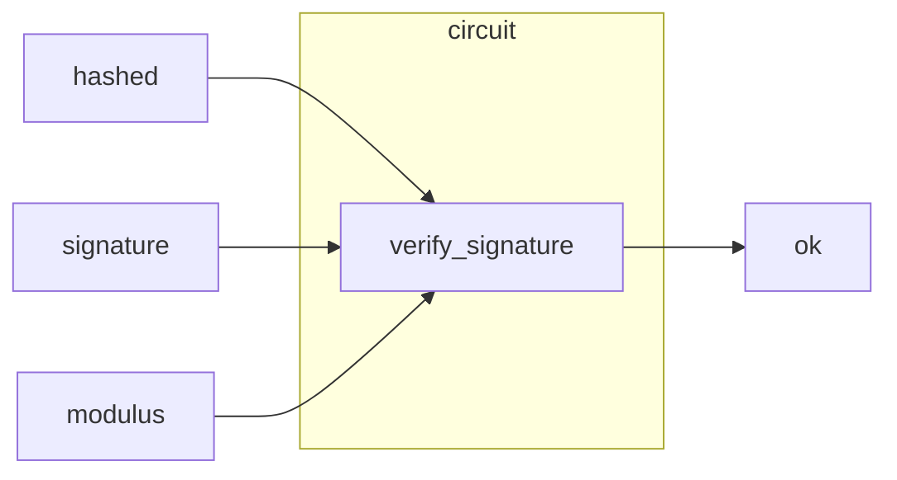

# RSA Signature Verification Circuit

The Circuit which Verifies RSA signature.

## Overview

This is the circuit overview.
(The input will change in phase2.)

## Functions

- `verify_signature()`: verify RSA signature and return assigned set values if signature is valid

## How verify_signature() works

(add it later)